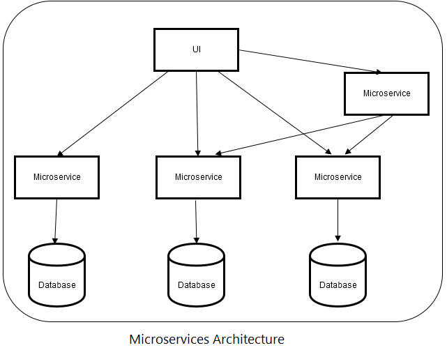

#### HW7. High Load Applications Architecture

## Instagram

## Choose proper architecture pattern for Instagram services

Instagram's architecture follows a microservices-based architecture pattern.

It allows for modular development, deployment, and scaling of individual services, enabling independent teams to work on different parts of the application. Each service handles specific functionalities like user management, photo sharing, notifications, etc.

Also, I'm sure, the Instagram combine other architectural patterns like:

- **Caching**: Caching is essential to improve performance and reduce database load. Instagram probably uses caching mechanisms to store frequently accessed data like user profiles, images, and metadata. Popular caching technologies include Redis and Memcached.

- **Load Balancing**: Load balancing is essential to distribute incoming traffic evenly across multiple instances of services. Load balancers ensure that no single service becomes overwhelmed with requests, ensuring high availability and performance.

- **Sharding**: For massive data storage and retrieval, Instagram probably uses sharding, which involves partitioning data across multiple databases. Sharding enables the system to handle large datasets more efficiently.

- **Content Delivery Network (CDN)**: Instagram may leverage a CDN to distribute static content (such as images and videos) closer to end-users, reducing latency and improving content delivery speed.

- **Database Replication**: To ensure data availability and fault tolerance, database replication is often used. Instagram might use master-slave or master-master replication for databases.

- **Hashing**: For distributed data storage and retrieval, consistent hashing may be employed to efficiently manage data distribution across multiple nodes.

## Botleneck of microservices-based architecture

_In a Microservices Architecture, various factors can contribute to potential bottlenecks. These bottlenecks can impact the overall performance, scalability, and reliability of the application. Some common bottlenecks in Microservices Architecture include:_

- **Network Latency** Communication between microservices usually happens over the network, and high network latency can lead to delays in request/response times. If microservices make frequent synchronous calls to each other, it can slow down the entire application.

- **Microservice Chaining** When a request requires multiple microservices to process, chaining them together in a synchronous manner can create performance bottlenecks, as each microservice needs to respond before the next one can proceed.

- **Microservice Sprawl** Having a large number of microservices can lead to operational complexity. Each microservice requires resources, monitoring, and maintenance, which can strain system resources.

- **Load Balancing:** If microservices experience varying loads, load balancing between them can become a bottleneck if not properly managed.

- **Message Brokers and Queues:** Using message brokers for asynchronous communication between microservices can introduce bottlenecks if the message broker becomes a single point of failure or if message processing is slow.

#### Short Summary:

**Bottleneck**: Communication between microservices can be a potential bottleneck if not designed efficiently. High latency or network issues between microservices can slow down the overall application.

**Solution**: Optimize API design, use caching, and consider event-driven patterns to reduce direct communication between microservices.

## SPOF

In distributed systems and complex architectures like Microservices, there is always a risk of Single Point of Failure (SPOF), which can severely impact the overall system's availability and reliability. Identifying and mitigating SPOFs is crucial to ensure high system resilience. Here are potential SPOFs in each case:

- **API Gateway**: If the API gateway becomes a single point of entry for all client requests and it fails, all communication between clients and microservices could be disrupted.

- **Centralized Configuration Management**: If a centralized configuration server or service becomes unavailable, all microservices relying on it might fail to load proper configurations.

- **Service Discovery**: If the service discovery mechanism is a single point of failure, new microservices won't be able to register, and existing microservices won't be able to discover each other.

- **Message Brokers**: If there's a single centralized message broker handling all message communication, its failure can disrupt message flow between microservices.

- **Authentication and Authorization Services**: A centralized authentication and authorization service failure can prevent access to all microservices.

##

The easiest way to deploy your Next.js app is to use the [Vercel Platform](https://vercel.com/new?utm_medium=default-template&filter=next.js&utm_source=create-next-app&utm_campaign=create-next-app-readme) from the creators of Next.js.

Check out our [Next.js deployment documentation](https://nextjs.org/docs/deployment) for more details.
